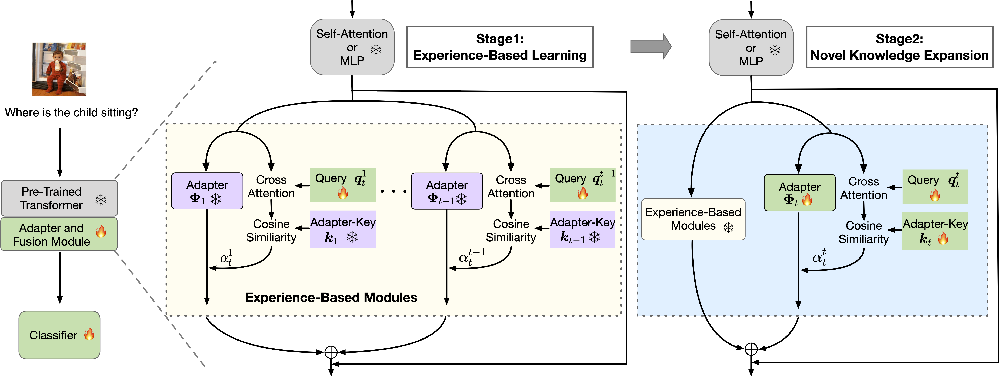

<h2 align="center">
 ATLAS: Adapter-Based Multi-Modal Continual Learning with a Two-Stage Learning Strategy
</h2>

<div align="center" margin-bottom="6em">
<a target="_blank" href="https://github.com/lihong2303">Hong Li<sup>✶</sup></a>,
<a target="_blank" href="https://openreview.net/profile?id=~Zhiquan_Tan1">Zhiquan Tan<sup>✶</sup></a>,
<a target="_blank" href="https://openreview.net/profile?id=~Xingyu_Li2">Xingyu Li<sup>✶</sup></a>,
<a target="_blank" href="https://www.weiranhuang.com">Weiran Huang</a>
</div>
&nbsp;

<div align="center">
    <a href="https://arxiv.org/abs/2410.10923" target="_blank">
    </a>
</div>
&nbsp;

<div align="left">

</div>

In this paper, we propose an adapter-based two-stage learning paradigm, a multi-modal continual learning scheme that consists of experience-based learning and novel knowledge expansion, which helps the model fully use experience knowledge and compensate for novel knowledge. Extensive experiments demonstrate that our method is proficient for continual learning. It expands the distribution of representation upstream while also minimizing the negative impact of forgetting previous tasks. Additionally, it enhances the generalization capability for downstream tasks. Furthermore, we incorporate both multi-modal and uni-modal tasks into upstream continual learning. We observe that learning from upstream tasks can help with downstream tasks.

## Installation

## Usage


## Reference

```bibtex
@misc{li2024atlasadapterbasedmultimodalcontinual,
      title={ATLAS: Adapter-Based Multi-Modal Continual Learning with a Two-Stage Learning Strategy}, 
      author={Hong Li and Zhiquan Tan and Xingyu Li and Weiran Huang},
      year={2024},
      eprint={2410.10923},
      archivePrefix={arXiv},
      primaryClass={cs.LG},
      url={https://arxiv.org/abs/2410.10923}, 
}
```
